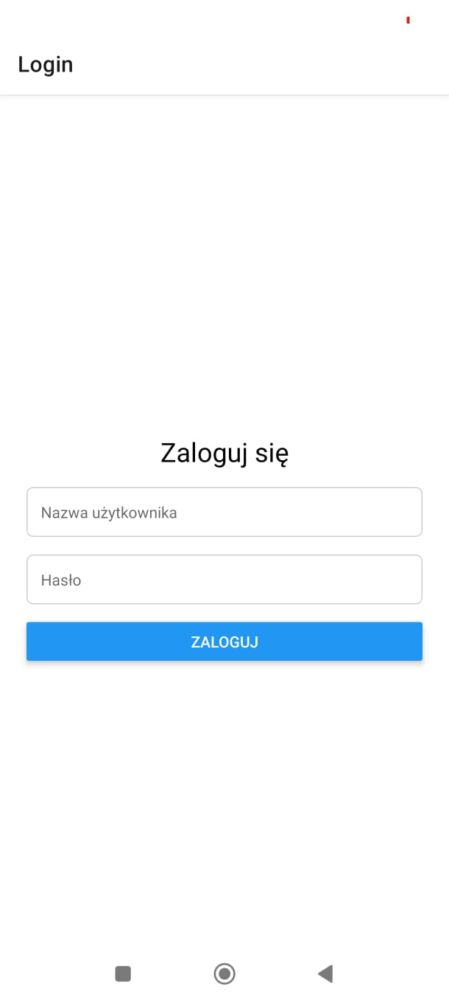
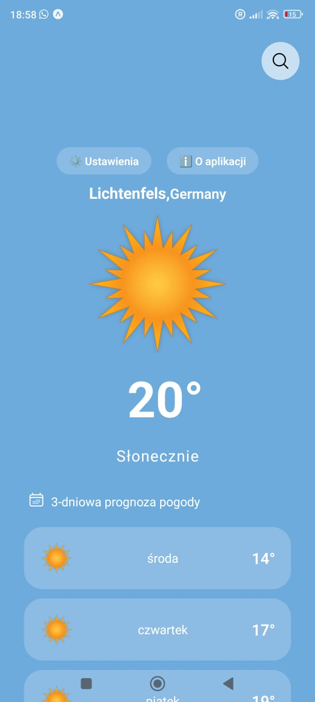
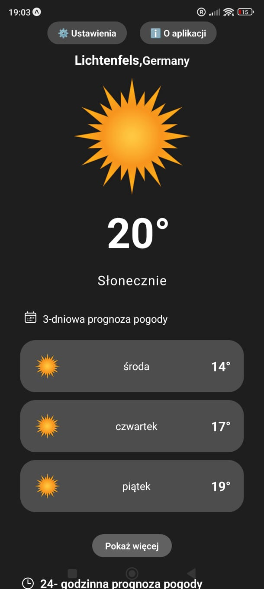
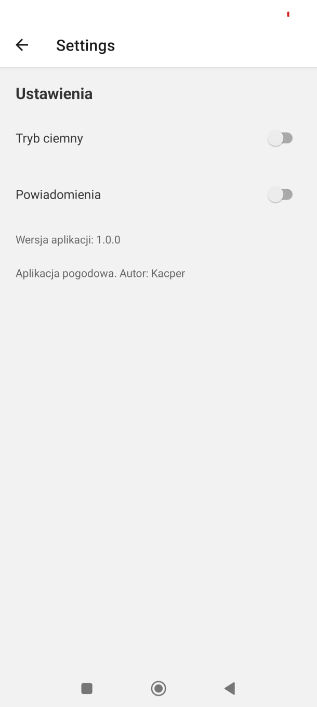
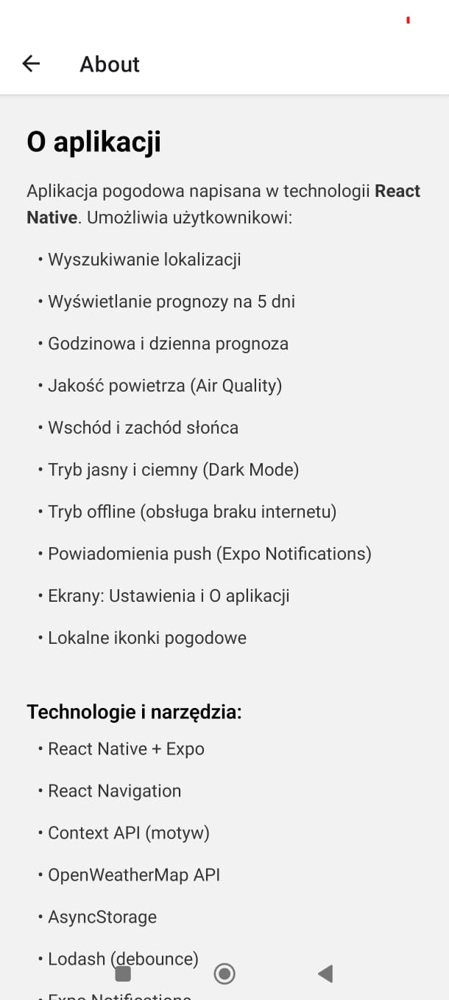

# 🌦️ Weather App

## 📄 Description

Weather App is a simple and clean mobile application built with **React Native** that allows users to check current weather conditions based on their location or any chosen city. It retrieves real-time weather data using an external weather API and presents it in a user-friendly interface with custom weather icons.

## 🚀 Features

- 🌍 Get current weather based on device geolocation.
- 🔎 Search weather information for any city.
- 🌡️ Display key weather data:
  - Temperature
  - Humidity
  - Wind speed
  - Weather description
- ⚠️ Proper handling of loading states and errors.
- 🎯 Local mapping of weather conditions to custom icons.
- 💎 Clean, intuitive, and responsive UI.

## 🖼️ Screenshots

### Login Screen  

### Home Screen  

### Home Screen Dark Mode  

### Settings Screen  

### About Screen  

## 🛠️ Tech Stack

- React Native
- React Navigation
- Context API
- Custom Hooks
- AsyncStorage
- Lodash
- Weather API (e.g. OpenWeatherMap)

## 📁 Project Structure

/assets
/components
/CustomHook
/navigation
/screens
/screenshots
/utils
App.js
README.md
package.json

- `HomeScreen` – displays current weather.
- `useWeather` – custom hook for fetching and managing weather data.
- `CurrentWeather` – displays weather details with matching icons.
- `SettingsScreen` & `AboutScreen` – additional application screens.
- `Navigation` – handles navigation between screens.

## ⚙️ Installation

1️⃣ Clone the repository:

#### git clone <repository-url>

2️⃣ Install dependencies:

#### npm install

 or

#### yarn install

3️⃣ Run the app:

#### npx react-native run-android

 or

#### npx react-native run-ios

 or

#### npm run web

## ⚠️ Notes

- Make sure location permissions are granted for geolocation functionality.

- Set your API key for the weather service in the environment configuration.

## ✨ Possible Future Improvements

- Dark mode support

- 5-day forecast feature

- Temperature unit switching (Celsius / Fahrenheit)

- UI animations

- Offline weather data caching